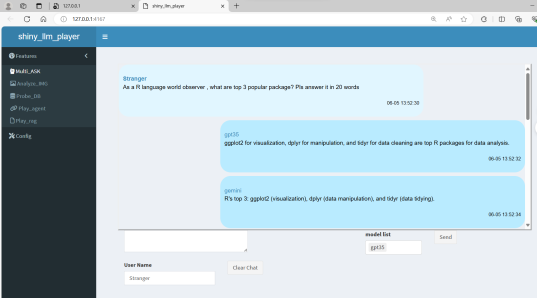

## Shiny large language model(llm) player

### 1. Purpose

Shiny LLM player is designed to provide a user-friendly interface for playing with multiple large language models easily, the core features are MAP.

|  |  |
|---|---|
|   | -   **Multi ASK**, Ask text question & chat with multiple models ,<br />-   **Analyze IMG**, Vision picture topic and contents   <br />-   **Probe DB**, Evaluate a database value, query data with nature language                 |


### 2. Core Concept

The core concept of Shiny llm player app is value driven which including -

-   **Multi connection**, instead of connect to one model, user ask one or more models work for task via drop down list. Openrouter API service was choice as base connector service. It is not free, but a api connectors to provide the [best models & prices](https://openrouter.ai/models) for your prompts service.

-   **More reproducible**, instead of get random geneated answers, using predefine parameter to let model answer reproducible.(still testing)

-   **Less dependence,** instead of using various models api library and agent library like lang chain, it is developed based on R an CRAN. (shiny, httr2, purrr, tidyverse, jsonlite, box and others r packages used)

### 3. Features snapshot

#### 3.1 Multi Ask

Ask one question, all the selected models will response the answer based on their model understanding. You may open eyes to check how different or how exact same of those answer.

|  | | 
| -------- | -------- | 
|      | With multi ask feature, you just ask and select desired one., shiny LLM player will collect answer for you.  <br/><br /> Besides, the cost of for heavy using large language model is becoming a concern now. If model give same quality answer, why not use low cost model for common question. The fashion and popular models will be responsible for hard question. |


#### 3.2 Analyze Image

image + model + your question + click = analyze picture answer.

|||
|---|---|
|  | You can upload local image to app, and select mulit-mode supported large language model(such as gemini, and chatgpt4v, chatgpt 4o). <br /> <br />  The app will send both picture and your question(prompt ) to specific models ans show the answer.|


#### 3.3 Probe DB

The probe DB feature is targeted to help people use large language mode to evaluation value, catalog list , query their data.

by combined the database schema and statistic information

|||
|---|---|
| 1. Evaluation <br /> | - In the past, expert know their industry knowledge at expert level. However, they will be beginner level when jump into new industry. As ordinary, they will face a stiff learning curve as well. But I think LLM can change it. <br /> <br /> - Instead of text to sql application, I put the evaluation data business value and opportunities as the 1st feature. LLM can help user explore this section instance without hiring consultant and spent long waiting time. <br /><br /> - For example, the hospital datasets been evaluated by LLM for how to improve patient care, operational efficiency and etc.|
| 2.  follow the opportunities to ask question -  | Using natural language to ask how to improve patience care.  |
| 3. Get data instantly <br />| the current patient appointment showed instantly.|
|||
| 4.  Inside work <br /> ||
| - APP make Prompt from user question and others <br /> | After received user question(natural language), shiny llm play convert it to prompt with database schema info|
| - LLM generate SQL based on sytem prompt   |  <br /> - LLM provide the sql query base on natural language question. <br /> -  Shiny llm app use the sql query get local data and show it|
| 5.  Openbox - Sample Dataset <br />  | - Popular database samples is open box ready. <br /> - Three medium size database extracted from spider NLP2SQL project and ready for demo purpose <br /><br /> -  a.  Music - the famous chinook datasets <br /> - b.  Dvd Rental - the famous sakila dataset <br /> - c.  Hospital - a hospital operation databse| +--------------------------------------------------------------------------------------------------+---------------------------------------------------------------------------------------------------------------------------------------------------------------------------------------------------------------------------------+

### 4. How to Use

To use the shiny llm player, you has two choices:

#### 4.1. play from web demo,

just open below link for fun, demo 

#### 4.2. play and study at your local computer

if you are familiar with Rstudio, clone it as your new project and have fun.


| step |note|
|---|---|
|||
| 1. clone new project from github <br /> | the github url is : [shiny_llm_player](https://github.com/Wang-Yong2018/shiny_llm_player) |
| 2 Get OpenAPI key  |  - link: <https://openrouter.ai/keys>  <br /> - There are free models  but popular model charged per usage.|
| 3. fill .Renviron file with key <br /> | write the api key in to .Renviron under project root folder|
| 4. Run it                | Launch it by open app.R and click Run button|
| 5). Play it               | Enjoy it and have fun!|

#### 4.3 Funcation usage

If the source code has been download to local computer, and open the project at Rstudio. You can call some function directly

-   step 1, open the llmapi.R under etl folder, and click the source to load the script. Note: directly source('../etl/llmapi.R') will report Error, it has be to sourced by Rstudio file menu.

```{r}
llm_result <- get_llm_result(prompt='hello ai world', model_id='gpt35',llm_type='chat')
ai_result <- get_ai_result(llm_result,ai_type='chat')
print(ai_result)
```

### 5. Q&A

|||
|---|---|
|5.1 Q:the app response is unauthorized<br /> | - a. pls check your openrouter api is configured and valid.<br /> - b.  The api key should be write in .Renviron file <br />  <br /> - c.  the api key should be valid and not over limit <br /> |
### 6. Citation

If you use this code for your research or project, please cite it as follows:

```         
OpenRouter[2024]. Quick Start. Retrieved from [https://openrouter.ai/docs/quick-start].
```

```         
Google[2024]. https://github.com/google-gemini/cookbook. Retrieved from [https://github.com/google-gemini/cookbook].
```

```         
OpenAI[2024]. openai-cookbook. Retrieved from [https://github.com/openai/openai-cookbook].
```

```         
Hadley Wickham (2023). httr2. GitHub Repository. Retrieved from [https://github.com/r-lib/httr2/].
```

```         
Hadley Wickham (2023). Functional Programming Tools • purrr. GitHub Repository. Retrieved from [https://github.com/tidyverse/purrr/].
```

```         
Jinhwan Kim (2023). Use google’s Gemini in R with R package “gemini.R”. GitHub Repository. Retrieved from [https://github.com/jhk0530/gemini.R].
```
